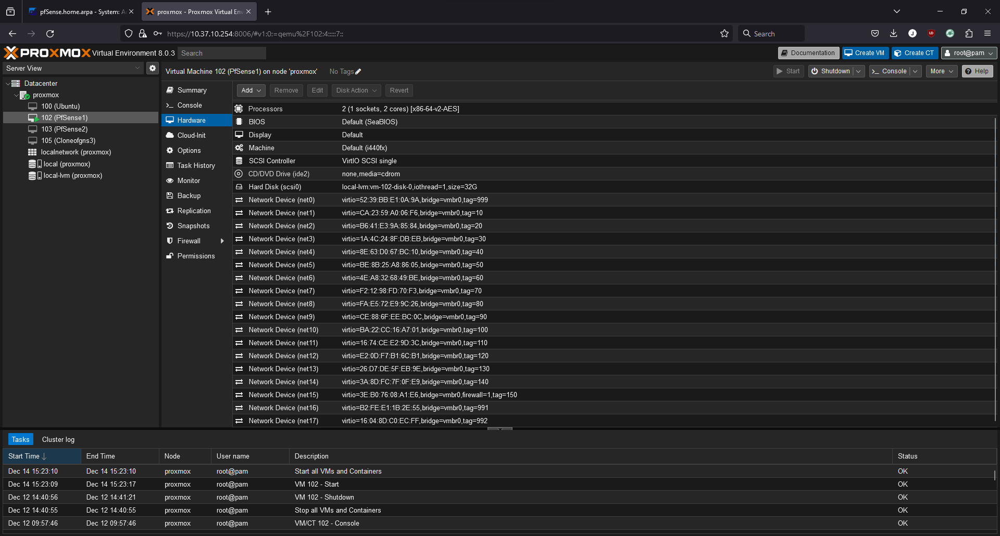
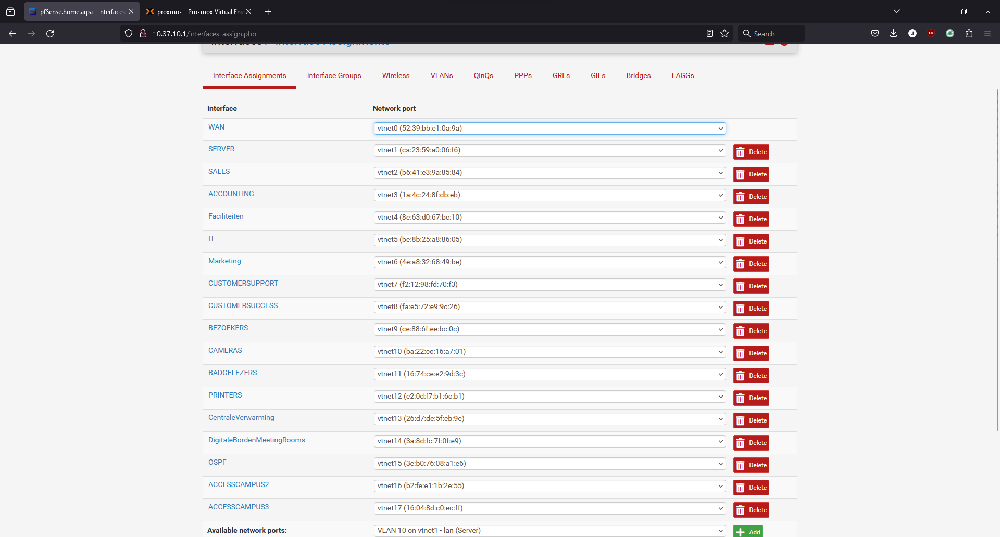
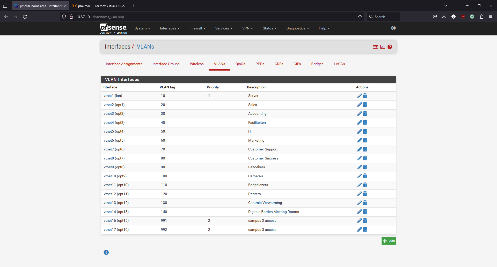
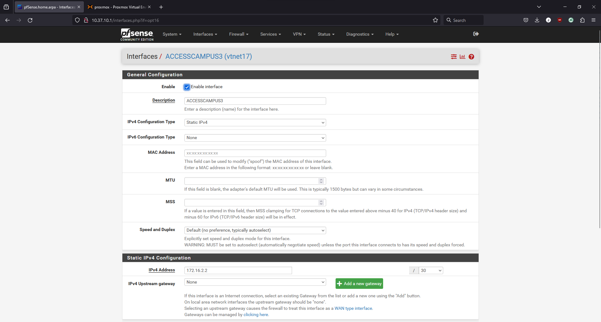
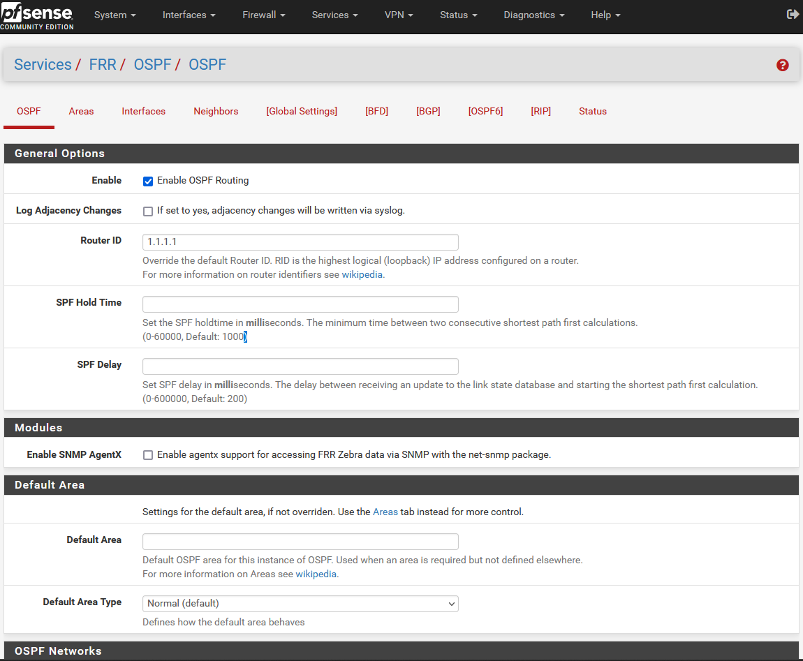
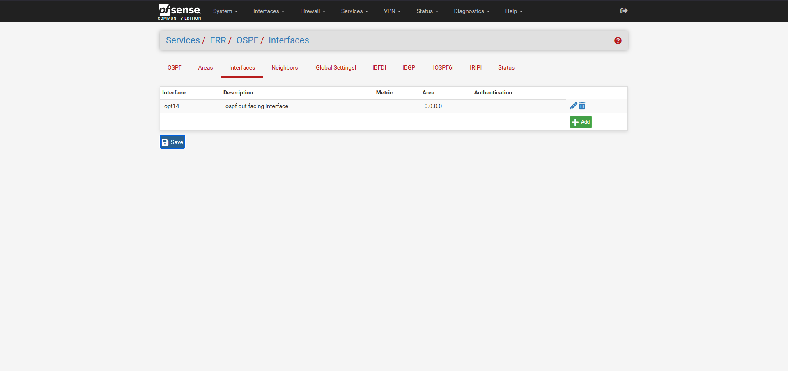
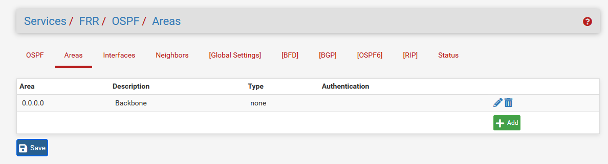
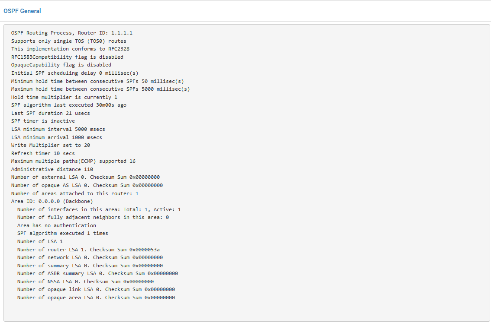
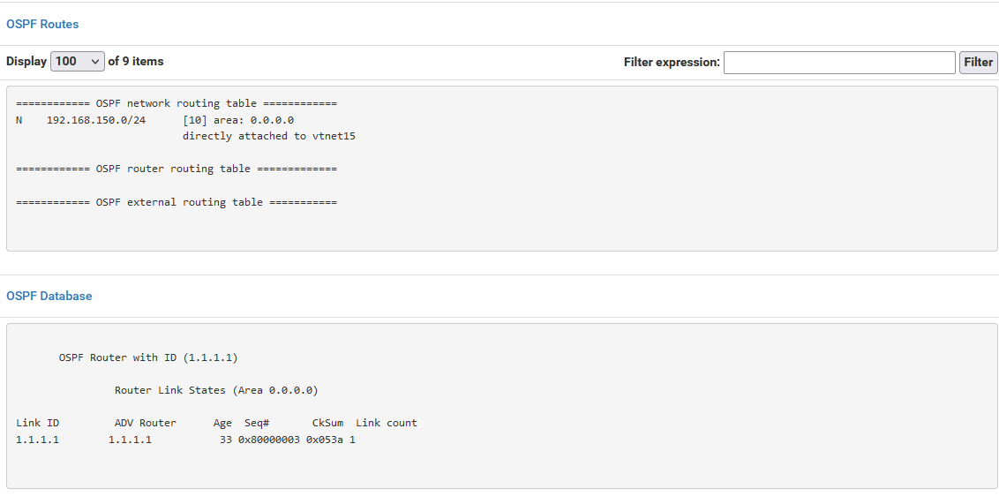
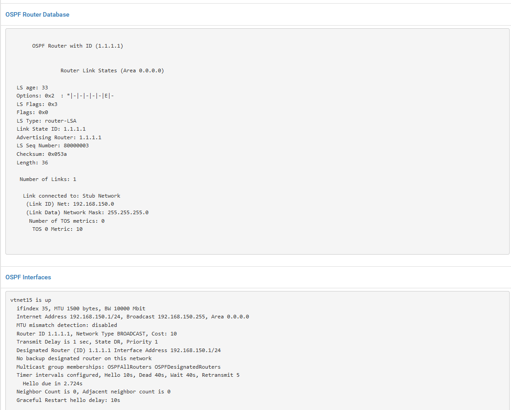

# PfSense

Wij wilden eerst met PfSense werken als router op onze hoofdcampus maar door gebrek aan tijd in het labo (aangezien die PfSense op onze Proxmox server stond) hebben wij dit niet kunnen afmaken en zijn we de laatste les nog aan de slag gegaan met het volledig opzetten van de opdracht met Cisco apparatuur.

Hieronder wel de configuratie die wij hadden op Proxmox en PfSense:

### Promox Netwerk Interfaces

### PfSense Netwerk Interfaces

### PfSense Vlan Interfaces

### PfSense Configuratie voor Access Campus 3

Wij waren nog aan het zoeken hoe dit in zijn werking ging gaan en zijn dus niet veel verder gekomen als dit. Hieronder nog de configuratie van extra interfaces voor toegang van de andere campussen en ospf op pfsense. Dit was echter nog teveel zoekwerk om op tijd klaar te krijgen:

